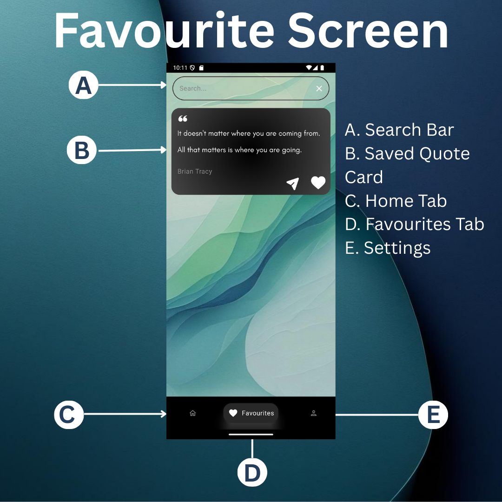

# 💭 Detoxy – Quotes App  


Detoxy is a **minimalistic motivational quotes app** built with modern Android tools and architecture.  
Originally developed as a **university project**, it’s now a great resource for learning Android development or starting your open-source contribution journey 🚀  

---

## 🛠 Built With
- **Kotlin**  
- **Jetpack Compose** (Modern UI Toolkit)  
- **Coroutines & Flow** (Async programming)  
- **MVVM + Clean Architecture**  
- **Hilt** (Dependency Injection)  
- **Retrofit** (Networking)  
- **Room** (Local database)  
- **WorkManager** (Background tasks)  

---

## ✨ Features
- 🌅 Fresh motivational quotes daily  
- 📂 Save favorite quotes offline  
- 📤 Share quotes with friends & family  
- 🏠 Home screen widget (auto-refreshes every 24 hrs)  
- 🔔 Daily inspiration via notifications  

---

## 📸 Screenshots
> Add screenshots of your app UI (emulator/device) in a folder named `screenshots/`  

<p align="center">
  
  
</p>

---

## 🤝 Contributing
Contributions, bug reports, and feature requests are welcome!  

### Contribution Guide
1. Fork this repository.  
2. Create your feature/bugfix branch:  
   ```bash
   git checkout -b feature/your-feature
